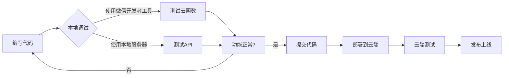

# 云开发本地调试指南

## 概述

微信云开发支持完整的本地开发调试能力，你可以在Mac上高效开发。

## 方案对比

| 方案 | 优势 | 劣势 | 推荐度 |
|------|------|------|--------|
| **微信开发者工具本地调试** | 官方支持，零配置，功能完整 | 需要打开微信开发者工具 | ⭐⭐⭐⭐⭐ |
| **本地Node.js + 云开发** | 灵活，可以用VSCode调试 | 需要额外配置 | ⭐⭐⭐⭐ |
| **混合模式（开发用本地，生产用云）** | 开发体验最好 | 需要维护两套代码 | ⭐⭐⭐⭐ |

## 推荐方案：微信开发者工具本地调试

### 为什么推荐？

1. **零配置**：官方支持，开箱即用
2. **功能完整**：支持云函数、数据库、存储的本地模拟
3. **断点调试**：可以直接打断点调试
4. **日志查看**：控制台直接查看日志
5. **热重载**：修改代码自动生效

## 具体操作步骤

### 1. 准备工作

```bash
# 确保已安装Node.js（云函数运行需要）
node --version  # 应该是 v12+
```

### 2. 项目结构设置

确保你的项目包含云函数目录：

```
skiing/
├── frontend/                 # 前端（uni-app）
│   ├── src/
│   └── dist/dev/mp-weixin/  # 编译输出
└── cloudfunctions/           # 云函数（可以放在frontend内或独立）
    ├── resort-search/
    │   ├── index.js
    │   └── package.json
    └── resort-detail/
        ├── index.js
        └── package.json
```

**重要**：云函数目录必须编译后能被微信开发者工具访问到。

### 3. 配置 project.config.json

在 `frontend/` 目录下创建（或修改）`project.config.json`：

```json
{
  "miniprogramRoot": "dist/dev/mp-weixin/",
  "cloudfunctionRoot": "../cloudfunctions/",
  "cloudfunctionTemplateRoot": "cloudfunctionTemplate/",
  "setting": {
    "urlCheck": false,
    "es6": true,
    "enhance": true,
    "postcss": true,
    "minified": false
  },
  "appid": "your-appid",
  "projectname": "skiing-miniprogram",
  "libVersion": "2.19.4",
  "cloudfunctionRoot": "../cloudfunctions/",
  "cloudbaseRoot": "./",
  "condition": {
    "search": {
      "list": []
    }
  }
}
```

### 4. 微信开发者工具配置

1. **打开微信开发者工具**
2. **导入项目**：
   - 选择目录：`frontend/dist/dev/mp-weixin`
   - AppID：你的小程序AppID
3. **开启云开发本地调试**：
   - 点击工具栏的"云开发"按钮
   - 切换到"云函数"标签
   - 右键任意云函数 → "开启本地调试"

### 5. 本地调试云函数

开启本地调试后：

```bash
# 云函数会在本地Node.js环境运行
# 支持以下功能：

✅ 断点调试（直接在微信开发者工具打断点）
✅ console.log 输出到控制台
✅ 热重载（修改代码自动重启）
✅ 数据库操作（连接本地模拟数据库）
```

### 6. 数据库本地调试

微信开发者工具提供了本地数据库模拟：

1. 打开"云开发" → "数据库"
2. 可以直接：
   - 查询数据
   - 插入数据
   - 更新数据
   - 删除数据

所有操作都会同步到云端（如果已连接云端环境）。

## 方案二：本地Node.js服务器（进阶）

如果你更喜欢用VSCode等编辑器调试，可以搭建本地服务器。

### 项目结构调整

```
skiing/
├── frontend/                 # uni-app前端
│   └── src/
├── backend/                  # 后端
│   ├── local/               # 本地开发服务器
│   │   ├── server.ts        # Express/Koa服务器
│   │   └── routes/          # API路由
│   └── cloudfunctions/      # 云函数（生产环境）
└── shared/                  # 共享类型和工具
    └── types/
```

### 本地服务器实现

```typescript
// backend/local/server.ts
import express from 'express';
import cors from 'cors';
import resortRoutes from './routes/resort';

const app = express();
const PORT = 3000;

// 中间件
app.use(cors());
app.use(express.json());

// 路由
app.use('/api/resort', resortRoutes);

// 启动服务器
app.listen(PORT, () => {
  console.log(`🚀 Local server running at http://localhost:${PORT}`);
});
```

```typescript
// backend/local/routes/resort.ts
import express from 'express';
import { ResortSearchService } from '../../../frontend/src/application/services/ResortSearchService';

const router = express.Router();

router.get('/search', async (req, res) => {
  try {
    const { keyword, type, limit, offset } = req.query;

    // 调用应用服务
    const service = new ResortSearchService();
    const results = await service.searchResorts({
      keyword: keyword as string,
      type: type as 'indoor' | 'outdoor',
      limit: Number(limit) || 20,
      offset: Number(offset) || 0,
    });

    res.json({
      code: 0,
      data: results,
    });
  } catch (error) {
    res.status(500).json({
      code: -1,
      message: error.message,
    });
  }
});

export default router;
```

### 前端API适配器

```typescript
// frontend/src/infrastructure/api/ResortAPI.ts
import { ResortDTO } from '@/application/dto/ResortDTO';

const IS_LOCAL = import.meta.env.MODE === 'development';
const API_BASE = IS_LOCAL ? 'http://localhost:3000/api' : '';

export class ResortAPI {
  async search(params: {
    keyword?: string;
    type?: 'indoor' | 'outdoor';
    limit?: number;
    offset?: number;
  }): Promise<ResortDTO[]> {
    if (IS_LOCAL) {
      // 本地开发：调用本地HTTP服务器
      const response = await fetch(`${API_BASE}/resort/search?${new URLSearchParams(params)}`);
      const result = await response.json();
      return result.data;
    } else {
      // 生产环境：调用云函数
      const result = await wx.cloud.callFunction({
        name: 'resort-search',
        data: params,
      });
      return result.result.data;
    }
  }
}
```

### 启动本地开发

```bash
# 终端1：启动后端服务器
cd backend/local
npm install
npm run dev  # 启动在 localhost:3000

# 终端2：启动前端
cd frontend
npm run dev:mp-weixin
```

## 方案三：混合模式（推荐大型项目）

### 架构设计

```typescript
// shared/config/env.ts
export const ENV = {
  isLocal: import.meta.env.MODE === 'development',

  // API配置
  apiBase: import.meta.env.MODE === 'development'
    ? 'http://localhost:3000/api'
    : '',  // 云函数模式

  // 数据库配置
  database: import.meta.env.MODE === 'development'
    ? 'mongodb://localhost:27017/skiing'
    : 'wx-cloud',  // 云数据库

  // 其他配置...
};
```

### 优势

- ✅ 开发时使用本地服务，调试方便
- ✅ 生产环境使用云开发，部署简单
- ✅ 可以复用应用层和领域层代码
- ✅ 灵活切换

### 注意事项

- ⚠️ 需要确保本地和云端数据结构一致
- ⚠️ 需要维护两套基础设施实现
- ⚠️ 测试时要覆盖两种模式

## 调试技巧

### 1. 云函数断点调试

在微信开发者工具中：
```javascript
// cloudfunctions/resort-search/index.js

exports.main = async (event, context) => {
  console.log('收到请求:', event);  // 查看输入参数

  // 在这里打断点
  const result = await searchResorts(event);

  debugger;  // 手动断点
  console.log('返回结果:', result);  // 查看返回值

  return result;
};
```

### 2. 查看详细日志

```javascript
exports.main = async (event, context) => {
  console.log('========== 开始执行 ==========');
  console.log('环境:', cloud.DYNAMIC_CURRENT_ENV);
  console.log('参数:', JSON.stringify(event, null, 2));

  try {
    const result = await db.collection('resorts').get();
    console.log('查询结果数量:', result.data.length);
    return result;
  } catch (error) {
    console.error('错误详情:', error);
    throw error;
  }
};
```

### 3. 使用 VSCode 调试（需要额外配置）

创建 `.vscode/launch.json`：

```json
{
  "version": "0.2.0",
  "configurations": [
    {
      "type": "node",
      "request": "launch",
      "name": "调试云函数",
      "skipFiles": ["<node_internals>/**"],
      "program": "${workspaceFolder}/cloudfunctions/resort-search/index.js",
      "env": {
        "NODE_ENV": "development"
      }
    }
  ]
}
```

## 常见问题

### Q1: 云函数本地调试报错"未找到云函数"

**A**: 检查 `project.config.json` 中的 `cloudfunctionRoot` 路径是否正确。

### Q2: 数据库操作失败

**A**:
- 确保已开通云开发
- 本地调试时会使用本地模拟数据库，可能需要先插入测试数据
- 检查环境ID是否正确

### Q3: 本地调试和云端不一致

**A**:
- 本地环境可能缺少某些云函数特性
- 部署到云端前务必在云端测试
- 使用环境变量区分本地和云端

### Q4: 如何查看云函数日志

**A**:
- 本地调试：微信开发者工具控制台
- 云端：云开发控制台 → 云函数 → 日志

## 推荐的开发流程



## 具体操作示例

### 完整的本地开发会话

```bash
# 1. 启动前端开发服务器
cd frontend
npm run dev:mp-weixin

# 2. 打开微信开发者工具
# - 导入项目：frontend/dist/dev/mp-weixin
# - 等待编译完成

# 3. 开启云函数本地调试
# - 点击"云开发"
# - 右键云函数 → "开启本地调试"
# - 看到提示"云函数本地调试已开启"

# 4. 开始开发
# - 修改云函数代码 → 自动重启
# - 修改前端代码 → 自动编译
# - 在微信开发者工具中查看效果

# 5. 调试
# - 在控制台查看日志
# - 在云函数代码打断点
# - 使用数据库面板查看数据

# 6. 测试完成后部署
# - 右键云函数 → "上传并部署：云端安装依赖"
# - 等待部署完成
# - 切换到云端模式测试
```

## 总结

| 你的需求 | 推荐方案 |
|---------|---------|
| 快速开发，不想折腾 | 微信开发者工具本地调试 |
| 喜欢VSCode，需要高级调试 | 本地Node.js服务器 |
| 大型项目，团队协作 | 混合模式（本地开发+云端部署） |

**对于滑雪小程序项目**，我推荐：
- 🥇 **首选**：微信开发者工具本地调试（最简单）
- 🥈 **备选**：混合模式（如果你熟悉Node.js开发）

## 下一步

1. 运行 `bash scripts/init-project.sh` 初始化项目
2. 按照本指南配置本地调试环境
3. 开始开发第一个功能：搜索滑雪场

有任何问题随时问我！
